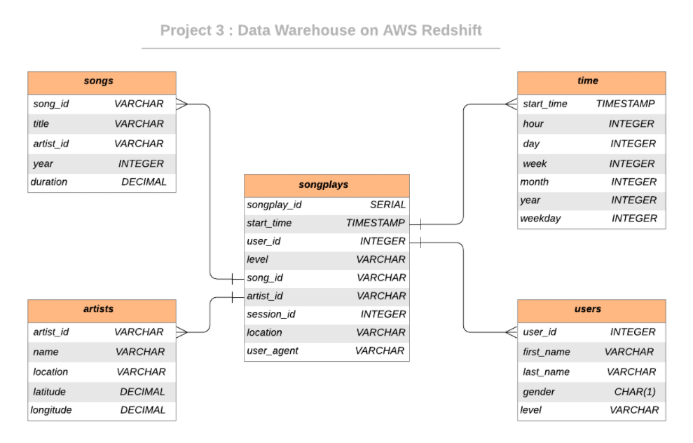

# Data Modeling with AWS Redshift 

## Introduction & Description

#### A music streaming startup, Sparkify, has grown their user base and song database and want to move their processes and data onto the cloud. Their data resides in S3, in a directory of JSON logs on user activity on the app, as well as a directory with JSON metadata on the songs in their app.

## Objective

#### Build an ETL pipeline that extracts their data from S3, stages them in Redshift, and transforms data into a set of dimensional tables for their analytics team to continue finding insights in what songs their users are listening to

## Dataset 

#### Song Dataset
Songs dataset is a subset of [Million Song Dataset](http://millionsongdataset.com/).  Each file in the dataset is in JSON format and contains meta-data about a song and the artist of that song. 

Sample Record :
```
{"num_songs": 1, "artist_id": "ARJIE2Y1187B994AB7", "artist_latitude": null, "artist_longitude": null, "artist_location": "", "artist_name": "Line Renaud", "song_id": "SOUPIRU12A6D4FA1E1", "title": "Der Kleine Dompfaff", "duration": 152.92036, "year": 0}
```

#### Log Dataset
Logs dataset is generated by [Event Simulator](https://github.com/Interana/eventsim).  These log files in JSON format simulate activity logs from a music streaming application based on specified configurations.

Sample Record :
```
{"artist": null, "auth": "Logged In", "firstName": "Walter", "gender": "M", "itemInSession": 0, "lastName": "Frye", "length": null, "level": "free", "location": "San Francisco-Oakland-Hayward, CA", "method": "GET","page": "Home", "registration": 1540919166796.0, "sessionId": 38, "song": null, "status": 200, "ts": 1541105830796, "userAgent": "\"Mozilla\/5.0 (Macintosh; Intel Mac OS X 10_9_4) AppleWebKit\/537.36 (KHTML, like Gecko) Chrome\/36.0.1985.143 Safari\/537.36\"", "userId": "39"}
```

## Database Schema Design 

The Star Database Schema (Fact and Dimension Schema) is used for data modeling in this ETL pipeline. There is one fact table containing all the metrics (facts) associated to each event (user actions), and four dimensions tables, containing associated information such as user name, artist name, song meta-data etc. This model enables to search the database schema with the minimum number of *SQL JOIN*s possible and enable fast read queries. The amount of data we need to analyze is not big enough to require big data solutions or NoSQL databases.

The data stored on S3 buckets is extracted to staging tables `staging_events` and `staging_songs` on Redshift. Then the data from these tables are transformed and inserted into the fact and dimensional tables. An entity relationship diagram (ERD) of the data model is given below. 



## Project structure

|     File / Folder      |                         Description                          |
| :--------------------: | :----------------------------------------------------------: |
| aws_cluster_create.py  | Creates and sets up a Redshift cluster on AWS with proper configurations |
| aws_cluster_destroy.py |       Destorys the Redshift cluster on AWS, if exists        |
|     sql_queries.py     | Contains the SQL queries for staging, schema definition and ETL |
|    create_tables.py    | Drops and creates tables on AWS Redshift (Reset the tables)  |
|         etl.py         | Stages and transforms the data from S3 buckets and loads them into tables |
|       analyze.py       | Basic querying from all tables created to ensure their validity |
|        dwh.cfg         |              Sample configuration file for AWS               |
|


## Project Steps

1. Design schemas for fact and dimension tables 

2. Edit the `dwh.cfg` configuration file and fill in the AWS Access Key and Secret Key fields

3. Run `aws_cluster_create.py` to create the clusters on AWS 

   The type, number of nodes and other specifications of cluster will be as per the configuration file. Wait till cluster creation confirmation is displayed.

4. Run `create_tables.py` to create/reset the tables

5. Run ETL process and load data into database `elt.py`

   This will execute SQL queries corresponding to staging data from S3 on Redshift and to transform and insert into the Postgres tables on Redshift.

6. Run `analyze.py` to validate the entry of data into tables

    This runs some sample queries from all the tables created.

7. Run `aws_cluster_destroy.py` to destroy the clusters on AWS


