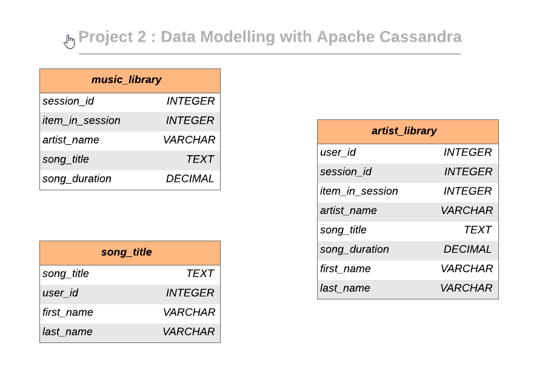

# Data Modeling with Cassandra

## Introduction & Description

#### A startup called Sparkify wants to analyze the data they've been collecting on songs and user activity on their new music streaming app. The analytics team is particularly interested in understanding what songs users are listening to. Currently, they don't have an easy way to query their data, which resides in a directory of JSON logs on user activity on the app, as well as a directory with JSON metadata on the songs in their app.

## Objective

#### Model data by creating tables in Apache Cassandra to run queries. As part of the ETL pipeline that transfers data from a set of CSV files within a directory to create a streamlined CSV file to model and insert data into Apache Cassandra tables. We will create separate denormalized tables for answering specific queries, properly using partition keys and clustering columns.

## Dataset 

#### Event Dataset

Event dataset is a collection of CSV files containing the information of user activity across a period of time.  Each file in the dataset contains the information regarding the song played, user information and other attributes . 

List of available data columns :

```
artist, auth, firstName, gender, itemInSession, lastName, length, level, location, method, page, registration, sessionId, song, status, ts, userId
```

## Database Schema Design 

The keyspace design is shown in the image below. Each table is modeled to answer a specific known query. This model enables to query the database schema containing huge amounts of data. Relational databases are not suitable in this scenario due to the magnitude of data. 



## Project structure

|     File / Folder      |                         Description                          |
| :--------------------: | :----------------------------------------------------------: |
|       event_data       | Folder at the root of the project, where all user activity CSVs reside |
| event_datafile_new.csv | Contains denormalized dataset|
|    Project 2.ipynb     | iPython notebook containing the ETL pipeline including data extraction, modeling and loading into the keyspace tables. |

## Project Steps

1. Run Project_DataModeling_Cassandra.ipynb 

2. Run Part 1 to create event_datafile_new.csv

3. Run Part 2 to initiate the ETL process and load data into tables

4. Check whether the data has been loaded into database by executing SELECT queries

