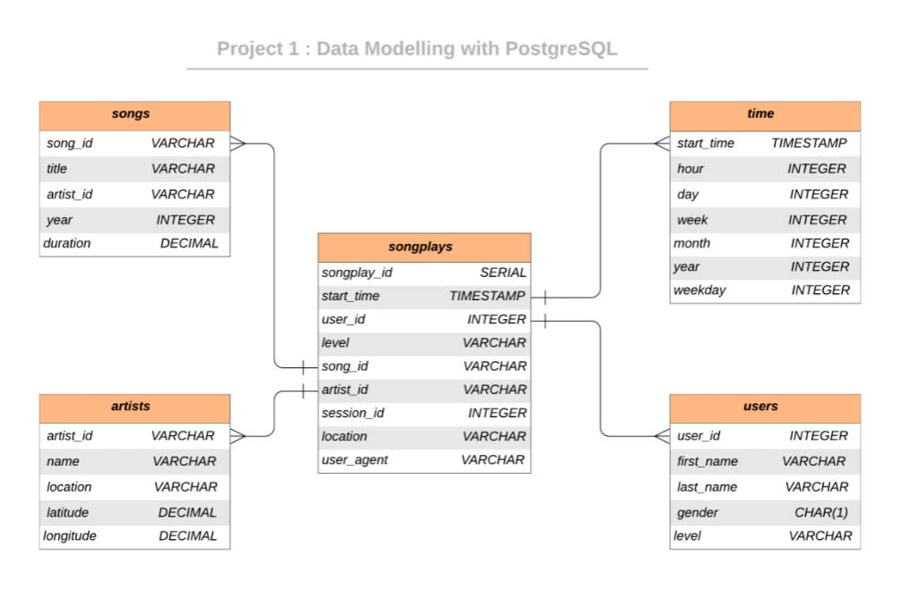

# Data Modeling with Postgres

## Introduction & Description

#### A startup called Sparkify wants to analyze the data they've been collecting on songs and user activity on their new music streaming app. The analytics team is particularly interested in understanding what songs users are listening to. Currently, they don't have an easy way to query their data, which resides in a directory of JSON logs on user activity on the app, as well as a directory with JSON metadata on the songs in their app.

## Objective

#### Define fact and dimension tables for a star schema for a particular analytic focus, and write an ETL pipeline that transfers data from files in two local directories into these tables in Postgres using Python and SQL.

## Dataset 

#### Song Dataset
Songs dataset is a subset of [Million Song Dataset](http://millionsongdataset.com/).  Each file in the dataset is in JSON format and contains meta-data about a song and the artist of that song. 

Sample Record :
```
{"num_songs": 1, "artist_id": "ARJIE2Y1187B994AB7", "artist_latitude": null, "artist_longitude": null, "artist_location": "", "artist_name": "Line Renaud", "song_id": "SOUPIRU12A6D4FA1E1", "title": "Der Kleine Dompfaff", "duration": 152.92036, "year": 0}
```

#### Log Dataset
Logs dataset is generated by [Event Simulator](https://github.com/Interana/eventsim).  These log files in JSON format simulate activity logs from a music streaming application based on specified configurations.

Sample Record :
```
{"artist": null, "auth": "Logged In", "firstName": "Walter", "gender": "M", "itemInSession": 0, "lastName": "Frye", "length": null, "level": "free", "location": "San Francisco-Oakland-Hayward, CA", "method": "GET","page": "Home", "registration": 1540919166796.0, "sessionId": 38, "song": null, "status": 200, "ts": 1541105830796, "userAgent": "\"Mozilla\/5.0 (Macintosh; Intel Mac OS X 10_9_4) AppleWebKit\/537.36 (KHTML, like Gecko) Chrome\/36.0.1985.143 Safari\/537.36\"", "userId": "39"}
```

## Database Schema Design 

The Star Database Schema used for data modeling in this ETL pipeline. There is one fact table containing all the metrics (facts) associated to each event (user actions), and four dimensions tables, containing associated information such as user name, artist name, song meta-data etc. This model enables to search the database schema with the minimum number of  *SQL JOIN*s possible and enable fast read queries. The amount of data we need to analyze is not big enough to require big data solutions or NoSQL databases.

An entity relationship diagram (ERD) of the data model is given below. 



## Project structure

|  File            |                         Description                          |
| :--------------: | :----------------------------------------------------------: |
|       data       | Folder at the root of the project, where all song and log data JSONS reside |
|  sql_queries.py  |      Contains the SQL queries for data modeling and ETL      |
| create_tables.py |         Drops and creates tables. (Reset the tables)         |
|    test.ipynb    |                Exploring the database tables                 |
|    etl.ipynb     | Processes a file from song_data and log_data and loads the data into tables |
|      etl.py      | Processes all files from song_data and log_data and loads them into  tables |
|      README      |                         Readme file                          |

## Project Steps

Follow the steps to extract and load the data into the data model.

1. Run `create_tables.py` to create database and tables in `sql_queries.py`

   ```python
   python create_tables.py
   ```

2. Build ETL process and load data into database by 

   ```python
   python etl.py
   ```

3. Check whether the data has been loaded into database by executing queries in `test.ipynb`


